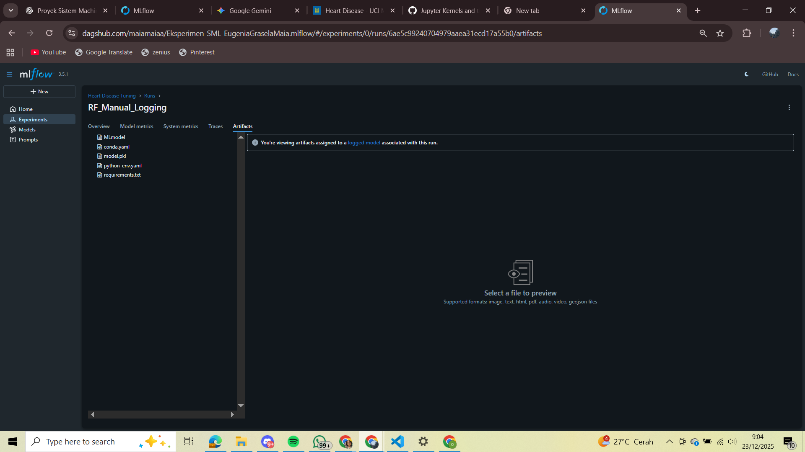

# Eksperimen Machine Learning – Heart Disease Prediction

## 📌 Deskripsi Proyek
Proyek ini bertujuan untuk membangun dan mengevaluasi model Machine Learning
dalam memprediksi penyakit jantung menggunakan dataset kesehatan.
Eksperimen dilakukan dengan menerapkan MLflow Tracking secara manual
dan disimpan secara online menggunakan DagsHub.

## 🧪 Metodologi
- Dataset: Heart Disease Dataset
- Algoritma: Random Forest Classifier
- Pembagian data: Train / Test
- Evaluasi: Accuracy, Precision, Recall, F1-score

## 🔍 MLflow Tracking (Manual Logging)
Eksperimen dicatat menggunakan **MLflow manual logging**, meliputi:
- Parameter model
- Metrik evaluasi
- Model terlatih
- Artefak tambahan:
  - Confusion Matrix
  - Feature Importance

## 🌐 MLflow Dashboard (DagsHub)
Tracking eksperimen dapat diakses melalui tautan berikut:

👉 https://dagshub.com/maiamaiaa/Eksperimen_SML_EugeniaGraselaMaia

## 📸 Screenshot MLflow

## 🗂️ Struktur Proyek
- `heart_raw/` : Dataset mentah
- `Workflow-CI/` : MLProject & workflow
- `Membangun_model/` : Training & tuning model
- `.github/workflows/` : CI pipeline

## 🛠️ Tools
- Python
- Scikit-learn
- MLflow
- DagsHub
- GitHub Actions
